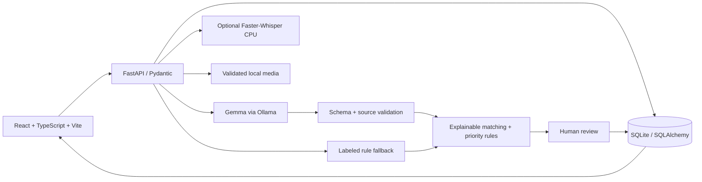

# RESQNET

**When every second matters, turn scattered emergency reports into coordinated action.**

<p align="center">
  <a href="https://resqnet-7w72.onrender.com/">
    
  </a>
</p>

A local disaster-report workspace with separate user and administrator portals. It accepts English, Bengali and Hindi reports, preserves evidence, suggests related incidents, and gives a human reviewer the final say. This is a research demonstration, not an emergency dispatch service or validated triage system.

## Deployment

- **Live app:** [resqnet-7w72.onrender.com](https://resqnet-7w72.onrender.com/)
- **Hosting:** Render free Docker web service. The React/Vite frontend is built into the same container as the FastAPI backend. Render health-checks `/api/health`.
- **Database:** Supabase PostgreSQL, configured on Render with the secret `RESQ_DATABASE_URL`.
- **File storage:** Supabase Storage in the private `resqnet-private` bucket.
- **Runtime settings:** The hosted app uses deterministic `rules` extraction. Voice processing is disabled and no responder gateway is configured.
- **Deploy updates:** Push to `main`; Render automatically builds and deploys the commit. Database URLs, storage keys and bootstrap passwords stay in Render's environment settings, never in this repository.
- **Free-tier behavior:** Render may spin the service down while idle, so the first request after a pause can take longer.

This is a research demo, not an official emergency service. Nearby lookup depends on public map providers and can be temporarily unavailable.

## What works

- Private user accounts, administrator login, individual case categories, critical-first review queues, assignment, shared status updates and two-way case messages. See [portal and database guide](docs/PORTALS.md).
- React operations dashboard with actual database metrics, an interactive Leaflet map, incident filters, solved cases with explanations, activity history, analytics and service health.
- Text reports with optional coordinates, automatically recorded observation time, affected-person count and requested assistance. Unknown coordinates stay unknown.
- Local Gemma through Ollama, schema-validated JSON and conservative checks on evidence and safety-sensitive fields. Every report records its actual extraction engine and processing time.
- Explicit deterministic fallback for unavailable or invalid model responses, with English/Bengali/Hindi keyword support.
- Weighted match suggestions with individual contributions. Reports always begin as separate incidents. Human approval is required for linking.
- Priority explanations, source references and conflicts. Repeated reports do not establish independent corroboration.
- Approval, rejection, correction, manual merge, separation, and verification flags with transaction-backed review records and audit history.
- Validated image uploads and metadata-free previews. Optional CPU Faster-Whisper transcription; users can edit transcripts before submission.
- A reproducible 30-report fictional dataset, 10 incident groups, separately stored labels and an executable evaluation script.
- Nearby police, fire/rescue and medical lookup using OpenStreetMap; permission-based live browser location, straight-line distances, directions, and persistent contact alerts. Car theft suggests police. External alert delivery requires a specifically authorized station gateway and explicit send consent; no station is connected by default. See [Nearby Help](docs/NEARBY-HELP.md).

## Architecture



SQLAlchemy models cover reports, incidents, report associations, extraction results, match suggestions, media, reviews and audit events. UUIDs, foreign keys, unique request keys, indexes, SQLite WAL and transaction scopes protect local state. The filesystem stores only normalized images and validated audio. No paid service is required.

```text
backend/           API, models, extraction, matching, priority, media validation
frontend/          React UI, Tailwind, shadcn-style button, Leaflet, Recharts
data/              Fictional reports, separately held labels, silent audio fixture
scripts/           Seed/reset, evaluation, dataset/audio generation
tests/             Backend and integration tests
docs/              API, demo, attribution, verification, screenshots
.github/workflows/ Backend and frontend CI
```

## Local setup: Windows PowerShell

Prerequisites: Python 3.12 and Node 24. Run from this repository root. All setup and run commands below use only local ports.

```powershell
py -3.12 -m venv .venv
.\.venv\Scripts\python.exe -m pip install --upgrade pip
.\.venv\Scripts\python.exe -m pip install -r backend/requirements.txt
Copy-Item .env.example .env
npm.cmd --prefix frontend ci
.\.venv\Scripts\python.exe -m scripts.seed
```

Start the backend in terminal 1:

```powershell
.\.venv\Scripts\python.exe -m uvicorn backend.main:app --host 127.0.0.1 --port 8000
```

Start the frontend in terminal 2:

```powershell
npm.cmd --prefix frontend run dev
```

Create the first administrator with `.\.venv\Scripts\python.exe scripts/create_admin.py --generate`. Its generated password is written to the ignored local file `runtime/admin-credentials.txt`. Additional administrators can be created with `--email name@example.com` using an interactive password prompt. Public registration always creates a user account.

Open [the user portal](http://127.0.0.1:5173/#user), [admin sign-in](http://127.0.0.1:5173/#admin), or [interactive API documentation](http://127.0.0.1:8000/docs). The permanent local database is `runtime/resq.db`, uploads are in `runtime/media`. Restarting either server preserves accounts, reports and conversations. Back it up with `.\.venv\Scripts\python.exe scripts/backup_database.py`; copy the media folder separately. The initial seed command refuses to overwrite existing incidents.

## Local setup: macOS / Linux

```bash
python3.12 -m venv .venv
source .venv/bin/activate
python -m pip install --upgrade pip
pip install -r backend/requirements.txt
cp .env.example .env
npm --prefix frontend ci
python -m scripts.seed
uvicorn backend.main:app --host 127.0.0.1 --port 8000
# In another terminal, from the repository root:
npm --prefix frontend run dev
```

## Local models and fallback

Install [Ollama](https://ollama.com), then:

```text
ollama pull gemma3:1b
```

Ollama's desktop service normally starts automatically. Otherwise run `ollama serve` in another terminal. `RESQ_AI_MODE=auto` attempts Gemma and falls back on service failure or rejected output. `RESQ_AI_MODE=rules` forces a reproducible offline demonstration. `RESQ_AI_MODE=ollama` also safely falls back if inference fails; it does not guarantee successful model output. The actual engine is always stored on each report.

Gemma 3 1B uses roughly 806 MB of downloaded weights. It is the low-memory baseline; Bengali/Hindi extraction quality must not be assumed. For a stronger multilingual option, install `gemma3:4b` and change `RESQ_OLLAMA_MODEL`, subject to available RAM. Both variants use Gemma's separate license. Review the [Gemma terms](https://ai.google.dev/gemma/terms).

The default Ollama timeout is 40 seconds per attempt. A cold load may time out and produce a labeled rules result. Warm the model with `ollama run gemma3:1b "Reply READY"` before a live demonstration, or adjust `RESQ_OLLAMA_TIMEOUT`. Malformed JSON receives one retry; connection failures fall back immediately.

Voice is optional:

```powershell
.\.venv\Scripts\python.exe -m pip install -r backend/requirements-voice.txt
```

Set `RESQ_VOICE_ENABLED=true` in `.env`, then restart the backend. The default multilingual Whisper `small` model runs on CPU with int8 and downloads on first use. Internet is required for that initial download. Upload a recording in Submit Report, listen to the preserved audio, correct the generated text, and submit. Recognition is imperfect; no prerecorded transcript is substituted on failure. Uploaded audio can remain attached if transcription fails and the operator types the source text manually.

Generate repeatable inputs:

```powershell
.\.venv\Scripts\python.exe -m scripts.synthetic_audio
powershell -File scripts/synthetic_speech.ps1
```

The first produces a silent WAV for no-speech tests. The second uses the installed Windows speech engine to generate an English fictional report. An original Bengali recording can be made from [the demo script](docs/DEMO.md); none is bundled.

## Dataset, reset and evaluation

```powershell
# Stop the backend first. Replaces all records in the configured app database:
.\.venv\Scripts\python.exe -m scripts.seed --reset
# Empty the configured app database for a three-report demonstration:
.\.venv\Scripts\python.exe -m scripts.seed --reset --blank
# Rebuild the source dataset and separately held ground-truth labels:
.\.venv\Scripts\python.exe -m scripts.generate_data
# Calculate actual extraction and pairwise matching metrics:
.\.venv\Scripts\python.exe -m scripts.evaluate --mode rules
```

The seed uses deterministic extraction and **scripted demonstration approvals**, recorded as such in the audit history. It never reads the ground-truth label file. This produces a useful preloaded dashboard; it is not evidence of real human verification. Every seeded report has `synthetic=true`. Reset removes database records but retains old uploaded files to avoid destructive filesystem deletion.

Evaluation compares all 435 pairs, including 30 true duplicate pairs and 405 nonduplicate pairs. Results are written to `runtime/evaluation-rules.json`; `--mode ollama` runs real local inference and reports any fallback usage. No evaluation metrics are hardcoded into the UI. The curated dataset is small and contains straightforward language and coordinates; performance must not be generalized to operational reports.

Matching uses `0.40 × geography + 0.25 × category + 0.25 × text + 0.10 × observation time`. Geographic similarity decreases linearly to zero at 3 km; time similarity decreases to zero at 24 hours. Missing coordinates or timestamps contribute zero. Unknown categories contribute zero. RapidFuzz measures lexical overlap, not multilingual semantic equivalence. The default suggestion threshold is 0.62, configurable with `RESQ_MATCH_THRESHOLD`. No score triggers automatic merging.

Priority adds 40 for source-supported trapped-person reports, 30 for medical requests, 30 for a reported fire, and 20 for rising water. Scores are capped at 100; high starts at 40 and medium at 20. Unknowns and conflicts remain visible. These weights are prototype review heuristics, not calibrated emergency or medical criteria.

## Verification commands

```powershell
.\.venv\Scripts\python.exe -m pytest -q
.\.venv\Scripts\python.exe -m ruff check backend tests scripts
.\.venv\Scripts\python.exe -m mypy backend
.\.venv\Scripts\python.exe -m pip_audit
npm.cmd --prefix frontend run test
npm.cmd --prefix frontend run lint
npm.cmd --prefix frontend run typecheck
npm.cmd --prefix frontend run build
npm.cmd --prefix frontend audit
```

With both servers running and an administrator created, browser tests submit marked synthetic reports, approve a match and exercise user/admin conversations. Tests use `runtime/admin-credentials.txt`, or `RESQ_TEST_ADMIN_EMAIL` and `RESQ_TEST_ADMIN_PASSWORD`. Use a disposable demo database; never reset a database containing real accounts or reports:

```powershell
Push-Location frontend
npx.cmd playwright install chromium
npm.cmd run test:e2e
Pop-Location
```

See [verification notes](docs/VERIFICATION.md) for the checks executed on the build machine and their limits. Frontend unit tests mock transport deliberately; backend tests and browser journeys exercise real persistence separately.

## Docker Compose

```text
docker compose up --build -d
docker compose exec backend python -m scripts.seed
```

The web app is at `http://127.0.0.1:5173`. SQLite and media use a named volume. Compose defaults to deterministic mode and loopback-only ports. Optional voice dependencies are not installed in the base image. Host Ollama connectivity varies by OS and bind configuration. Docker was not available in the build environment, so these image definitions have not been executed here.

## Limits and next work

- The public demo is deployed, but operational hardening remains unfinished: email verification, password recovery, MFA and formal security review are not configured. Read [SECURITY.md](SECURITY.md) before changing bind addresses.
- No confirmed emergency dispatch, geocoding, external incident feeds or source-identity verification. Coordinates can come from an operator or permission-based browser location and remain unverified. Nearby-service lookup and optional authorized gateway handoff do not establish station acknowledgment or emergency response.
- Rule extraction is intentionally narrow. Negation, spelled-out numbers, ambiguous context and complex multilingual grammar can fail. Model summaries and categories are unverified interpretations. Safety checks reduce hallucination risk, not eliminate it.
- Voice transcription is CPU-bound and serialized. Initial model download may be slow. No Bengali/Hindi audio accuracy benchmark is claimed.
- Images are evidence only; vision analysis is deferred. Audio metadata is preserved, unlike re-encoded image metadata.
- OpenStreetMap tiles need internet. Coordinates and markers still render on an empty map if tiles fail, with an explicit notice; no tiles are cached or bundled.
- The MVP loads all incidents and up to 500 reports in the UI. Matching scans existing active incidents. Larger datasets need pagination, spatial indexing and a job queue.
- Audit events are append-only through the API, not cryptographically tamper-proof. This upgrade adds tables without altering existing reports. Case edits use version checks; broader incident editing still needs careful operator coordination. There is no encryption at rest or automatic retention job.
- Optional vision and operational validation are deferred.

See [API reference](docs/API.md), [three-minute demonstration](docs/DEMO.md), [contribution guide](CONTRIBUTING.md) and [third-party attribution](docs/ATTRIBUTION.md). Original code is [MIT licensed](LICENSE); third-party dependencies and models retain their own terms.
